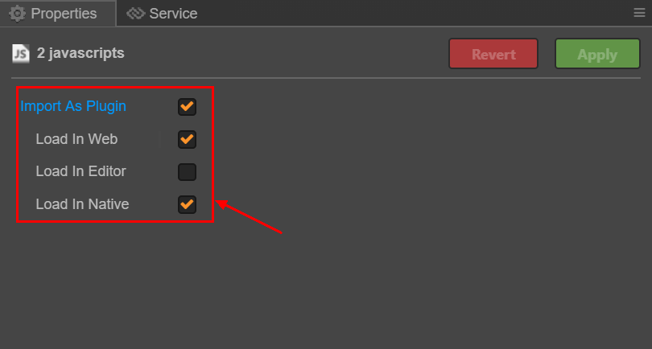
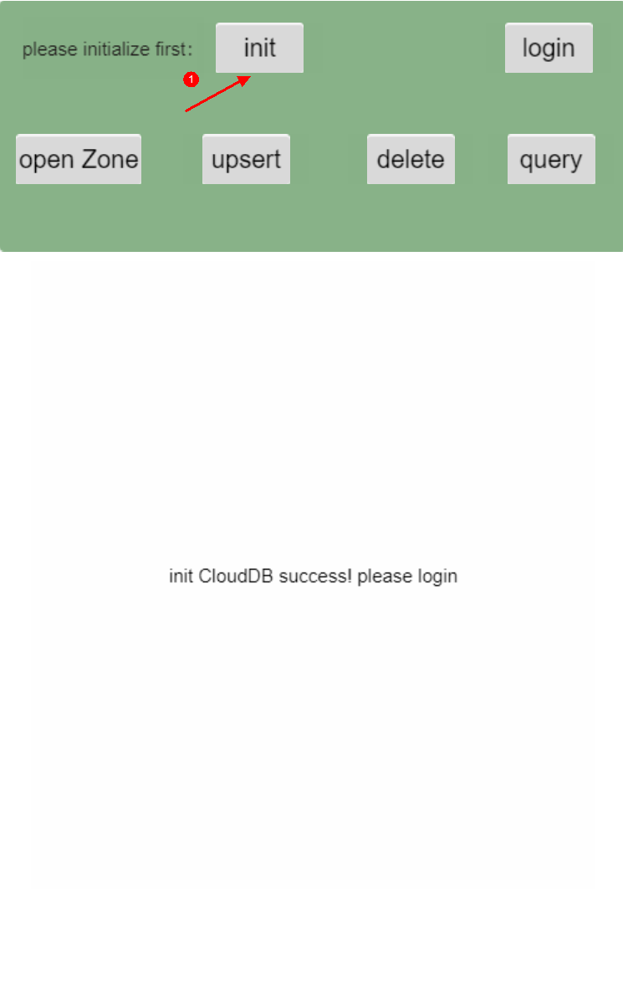
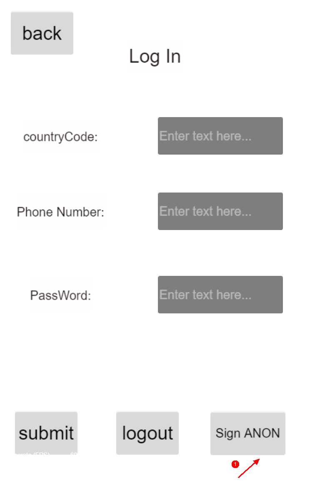
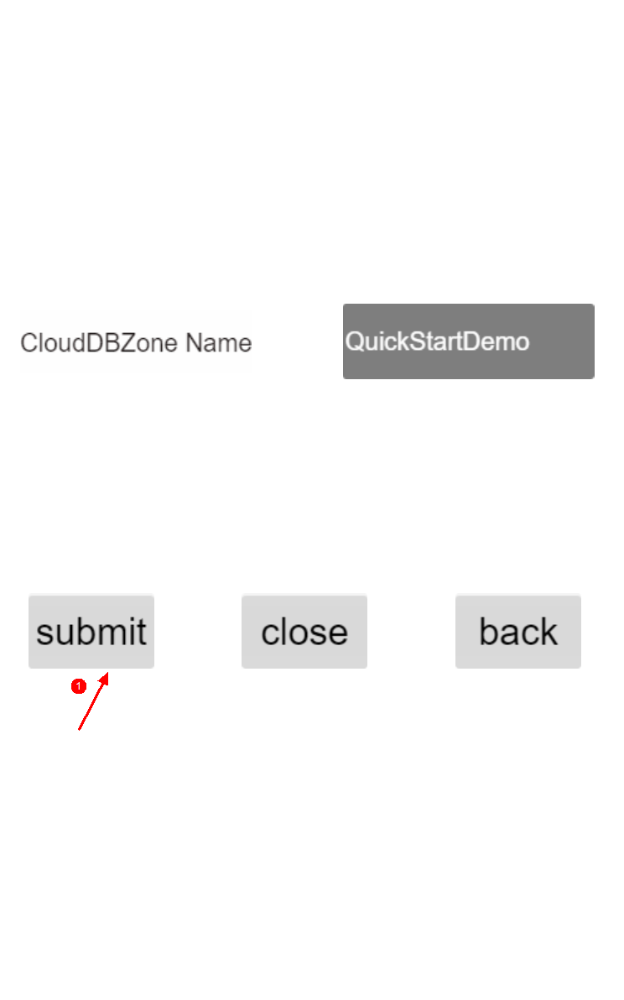
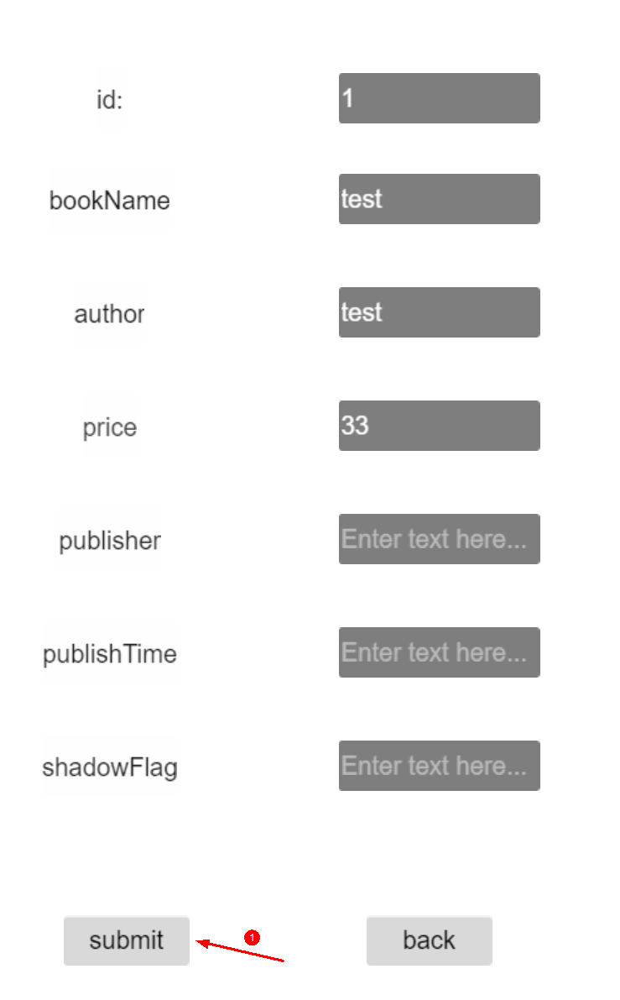
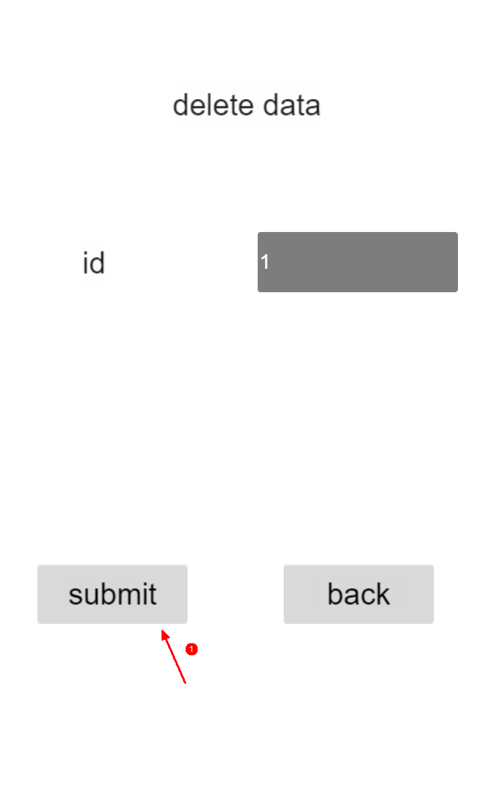
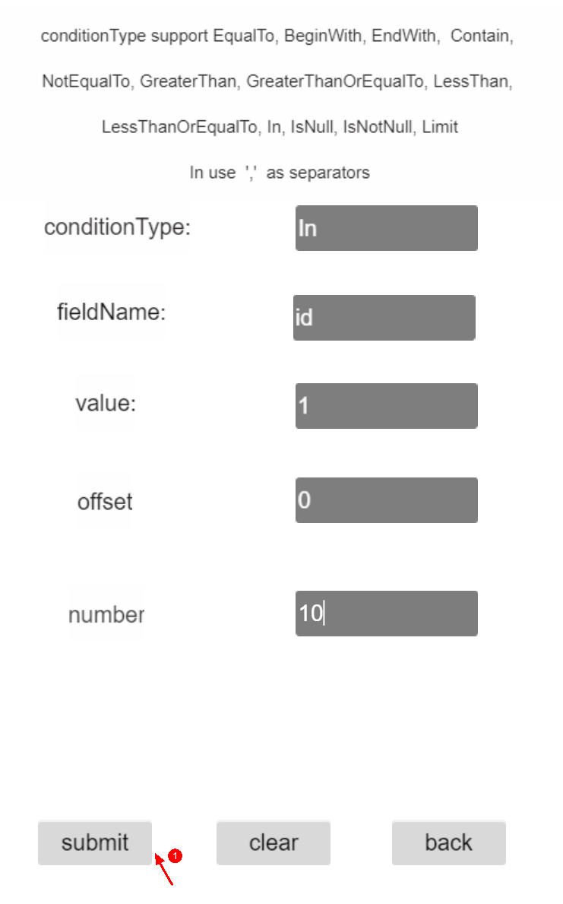

#  Cloud DB JS SDK Demo

## Introduction
This project is a quick start sample developed using Cloud DB JS SDK.

##  Quick Start
- On the [AppGallery Connect](https://developer.huawei.com/consumer/cn/service/josp/agc/index.html#/myProject) page, create a project and add a web application with named `QuickStartDemo`.

- Click **Auth Service** on the navigation bar and enable authentication using an anonymous account.

- Click **Cloud DB** on the navigation bar and enable database service. Then, perform the following operations:

    （1）Create a schema by importing a template file stored in **app-schema.js** in the `assets/Script/config/` directory of the project. Alternatively, create a object type named **BookInfo** and ensure that all fields must be the same as those in `assets/Script/model/BookInfo.js` of the project.

    （2） Create a Cloud DB zone. On the **Cloud DB Zone** tab page, click **Add** to create a Cloud DB zone named **QuickStartDemo**.

- On the Project Setting page, obtain the app configuration information. Save it to the context object in the `assets/Script/config/agconnect-services.js` file.

- Integrate the Cloud DB SDK.

  （1）Download the SDK files of the [authentication service](https://developer.huawei.com/consumer/cn/doc/development/AppGallery-connect-Library/agc-auth-quickgame-sdkdownload-0000001182308451) and [Cloud DB service](https://developer.huawei.com/consumer/cn/doc/development/AppGallery-connect-Library/agc-clouddb-sdkdownload-quickgame-0000001193097045).

  （2）Copy the JS files of the authentication service and Cloud DB service into the `assets/Script/` directory.

  （3）Open the [Cocos Creator](https://www.cocos.com/en/creator) editor and make the imported JS files as plugin.
  

## Operate Data

##### 1. Initialize config.

##### 2. Click the `Sign ANON` button to log in anonymously.

  

##### 3. Input zone name `QuickStartDemo` and click the `submit` button to open Cloud DB zone.

  

##### 4. Upsert a record.

  

##### 5. Delete a record.

  

##### 6. Query records.

  
