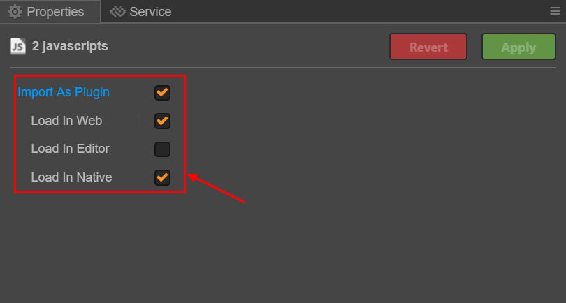
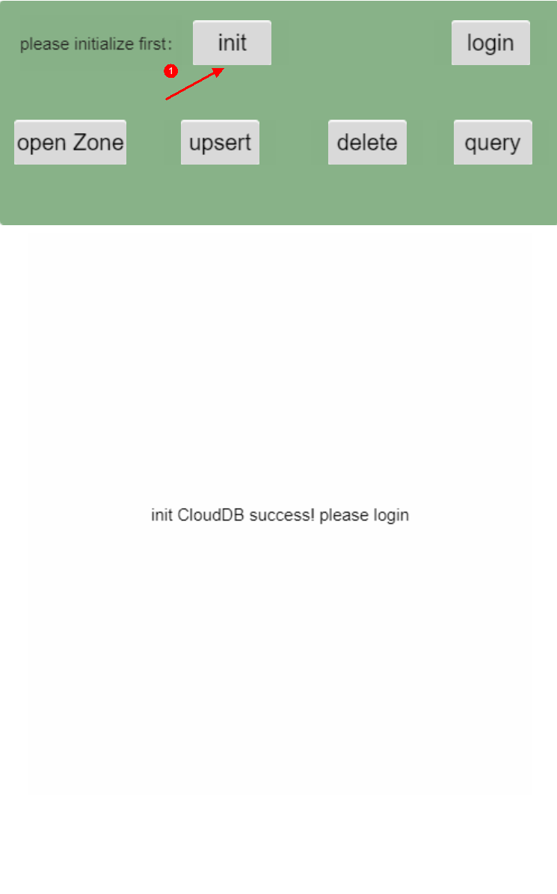
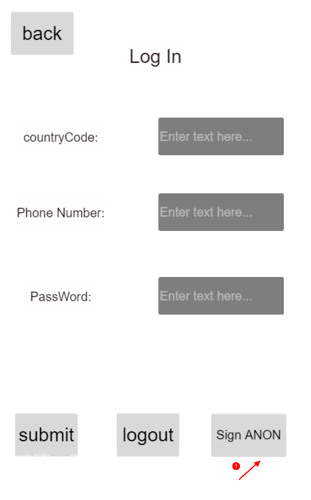
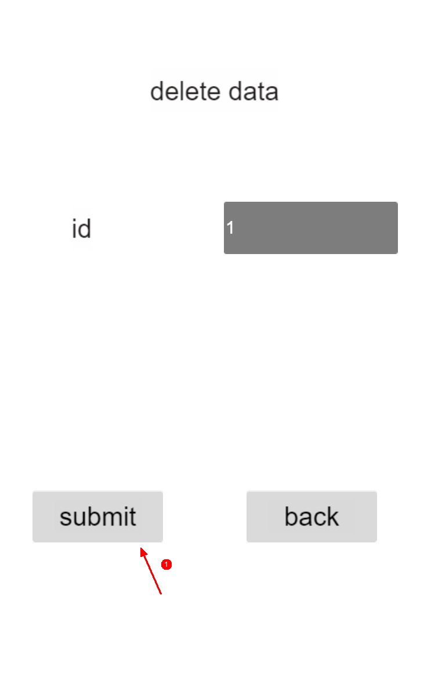

#  Cloud DB JS SDK Demo

## 概要简介
本项目是使用Cloud DB JS SDK开发的快速入门示例。

## 快速开始
- 在[AppGallery Connect](https://developer.huawei.com/consumer/cn/service/josp/agc/index.html#/myProject) 页面上，创建一个项目并添加名为`QuickStartDemo`的web应用。

- 单击导航栏上的**认证服务**，启用匿名帐户身份验证。

- 单击导航栏上的**云数据库**，启用云数据库服务。然后执行以下操作：

  （1）创建对象类型。

  在`对象类型`页面，通过导入**BookInfo.json**文件来创建对象类型，文件路径为`assets/Script/config/`。或者可以手动创建名为**BookInfo**的对象类型，并保证所有字段和`assets/Script/model/BookInfo.js`文件保持一致。

  （2）创建存储区。

  在`存储区`页面，**创建名为QuickStartDemo**的存储区。

- 在**项目设置**页面，获取应用配置信息。将其保存到`assets/Script/config/agconnect-services.js`文件中。

- 集成Cloud DB SDK。

  （1）下载[认证服务](https://developer.huawei.com/consumer/cn/doc/development/AppGallery-connect-Library/agc-auth-quickgame-sdkdownload-0000001182308451)和[云数据库](https://developer.huawei.com/consumer/cn/doc/development/AppGallery-connect-Library/agc-clouddb-sdkdownload-quickgame-0000001193097045)的JS文件。

  （2）将认证服务和Cloud DB服务的JS文件拷贝到`assets/Script/`目录下。

  （3）打开[Cocos Creator](https://www.cocos.com/en/Creator)编辑器，将拷贝的JS文件设置为插件。
  

## 操作数据

##### 1. 初始化配置文件。

##### 2. 点击`Sign ANON`进行匿名登录。

  

##### 3. 输入存储区名称`QuickStartDemo`并且点击`submit`打开存储区。

  

##### 4. 新增/修改数据。

  

##### 5. 删除数据。

  

##### 6. 查询数据。

  
